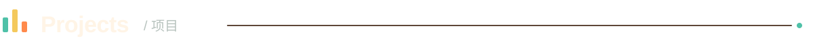
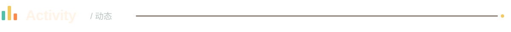

  

<picture>
  <source media="(prefers-color-scheme: dark)" srcset="./assets/header-projects.svg" />
  <source media="(prefers-color-scheme: light)" srcset="./assets/header-projects-light.svg" />
  
</picture>

| Project / 项目 | Notes / 简介 | Stars / 星标 |
| --- | --- | --- |
| [**Open-ClaudeCode**](https://github.com/LING71671/Open-ClaudeCode) | A research archive reconstructed from published Claude Code npm source maps. 从公开发布的 Claude Code npm source map 重建的研究资料归档。 |  |
| [**open-reverselab**](https://github.com/LING71671/open-reverselab) | An agent-native reverse-engineering lab with a knowledge base and MCP automation tools. 包含知识库与 MCP 自动化工具的智能体原生逆向工程实验室。 |  |
| [**Universal-AI-Protocol-Bridge**](https://github.com/LING71671/Universal-AI-Protocol-Bridge) | A Cloudflare Workers gateway for translating and routing chat API protocols. 运行在 Cloudflare Workers 上的聊天 API 协议转换与路由网关。 |  |
| [**CyberSilenter**](https://github.com/LING71671/CyberSilenter) | A local Windows helper for ChatGPT Desktop UI automation. 面向 ChatGPT Desktop 的 Windows 本地界面辅助工具。 |  |
| [**plugproxy**](https://github.com/LING71671/plugproxy) | A lightweight Go proxy collector, validator, pool, CLI, HTTP API, and SDK. 轻量级 Go 代理采集、检测与代理池，提供 CLI、HTTP API 和 SDK。 |  |
| [**Aegis-Watermark**](https://github.com/LING71671/Aegis-Watermark) | Blind watermarking and digital signatures for images, PDFs, and PPTX files. 面向图片、PDF 与 PPTX 的盲水印和数字签名工具。 |  |

<picture>
  <source media="(prefers-color-scheme: dark)" srcset="./assets/header-contact.svg" />
  <source media="(prefers-color-scheme: light)" srcset="./assets/header-contact-light.svg" />
  
</picture>

  Have an idea worth talking about? Email me. 
  有想聊的点子或合作，欢迎来信。中英文都可以。

  

<picture>
  <source media="(prefers-color-scheme: dark)" srcset="./assets/header-activity.svg" />
  <source media="(prefers-color-scheme: light)" srcset="./assets/header-activity-light.svg" />
  
</picture>

  
  

  <picture>
    <source media="(prefers-color-scheme: dark)" srcset="https://raw.githubusercontent.com/LING71671/LING71671/output/github-contribution-grid-snake-dark.svg" />
    <source media="(prefers-color-scheme: light)" srcset="https://raw.githubusercontent.com/LING71671/LING71671/output/github-contribution-grid-snake.svg" />
    
  </picture>

  

  <em>Thanks for visiting. / 感谢来访。</em>

