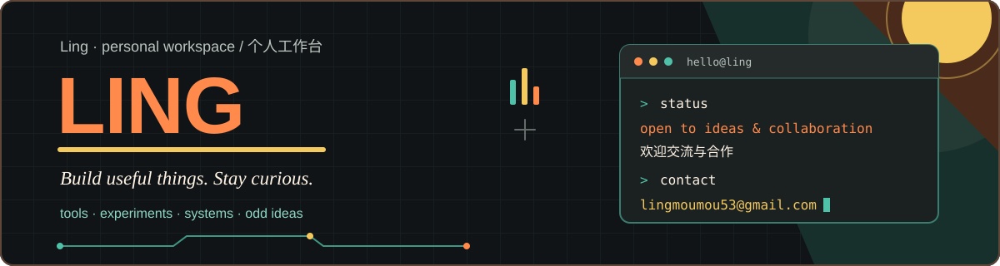

  

  A collection of tools, experiments, systems, and half-finished ideas. 
  这里放着一些工具、实验、系统，以及还没想完的点子。

---

## Say hello / 来聊聊

  Have an idea worth talking about? Email me. 
  有想聊的点子或合作，欢迎来信。中英文都可以。

  

  

---

## Sponsors / 赞助

  

  Thanks to all our sponsors. ❤️ 
  感谢所有赞助方。❤️

---

## Activity / 动态

  
  

  

  
  

---

## Toolbox / 工具箱

  &nbsp;
  &nbsp;
  &nbsp;
  &nbsp;
  &nbsp;
  &nbsp;
  &nbsp;
  &nbsp;
  &nbsp;
  &nbsp;
  &nbsp;
  

---

## Contributions / 贡献

  

  <em>Thanks for visiting. / 感谢来访。</em>

